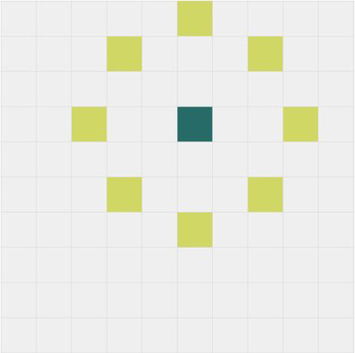

This project was bootstrapped with [Create React App](https://github.com/facebookincubator/create-react-app).

[Try it](https://slavkopar.github.io/core-game/)

The Game Rules:

- The first click on board will define the player’s start position.

- To complete a level, the player must click on all generated fields. 
- Each new level will have one more box than the previous level.

- Player can click not more or less than 3 fields vertically and horizontally, or not more or less than 2 fields diagonally.

